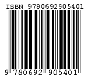

# go-isbn

[]

Validate, parse, and convert International Standard Book Number (ISBN) data.

In addition to simply checking the length, characters and check-digit
of an ISBN this also parses the ISBN using the ISBN ranges data
available from https://www.isbn-international.org/range_file_generation
in order to verify that the Prefix, Registration Group, and Registrant
elements of the ISBN are valid.
